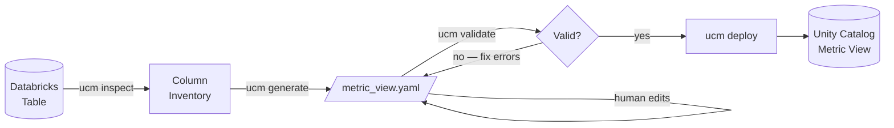

# uc-metric-views

[](https://github.com/barath2904/uc-metric-views/actions/workflows/ci.yml)
[](https://pypi.org/project/uc-metric-views/)
[](https://pypi.org/project/uc-metric-views/)
[](LICENSE)

Generate, validate, and deploy [Databricks Unity Catalog metric views](https://docs.databricks.com/en/sql/language-manual/sql-ref-metric-view.html) from YAML definitions.

A metric view is a reusable semantic layer object in Databricks — it defines dimensions, measures, and joins over your tables so that BI tools and Genie can query business metrics consistently without embedding logic in every dashboard.

---

## How it works



---

## ⚙️ Installation

```bash
pip install uc-metric-views
```

---

## 🔐 Authentication

Set credentials before running any command that connects to Databricks.

### OAuth M2M — Service Principal (recommended for CI/CD)

```bash
export DATABRICKS_HOST="https://your-workspace.cloud.databricks.com"
export DATABRICKS_CLIENT_ID="your-service-principal-client-id"
export DATABRICKS_CLIENT_SECRET="your-service-principal-secret"
export DATABRICKS_WAREHOUSE_ID="abc123"  # required for deploy
```

Create a Service Principal in your Databricks account console and grant it `USE CATALOG`, `USE SCHEMA`, and `CREATE` privileges on the target catalog and schema.

### Personal Access Token (PAT)

```bash
export DATABRICKS_HOST="https://your-workspace.cloud.databricks.com"
export DATABRICKS_TOKEN="dapi..."
export DATABRICKS_WAREHOUSE_ID="abc123"  # required for deploy
```

PATs can also be passed via `--host` and `--token` CLI flags. `~/.databrickscfg` profiles are supported for local development.

---

## 🖥️ CLI

#### 1. Inspect a table

See column types and suggested roles (dimension / measure / ignore) before generating:

```bash
ucm inspect --source analytics.gold.fct_orders \
            --join analytics.gold.dim_customer
```

#### 2. Generate a metric view YAML

Scaffold a YAML file from a fact table and optional dimension joins:

```bash
ucm generate --source analytics.gold.fct_orders \
             --join analytics.gold.dim_customer \
             --output ./metric_views/order_metrics.yaml
```

Review and refine the generated file — add semantic metadata, window measures, or materialization config as needed.

#### 3. Validate

Check YAML files against the Databricks metric view spec:

```bash
ucm validate ./metric_views/                    # validate a directory
ucm validate ./metric_views/order_metrics.yaml  # validate a single file
ucm validate ./metric_views/ --strict           # treat warnings as errors (CI)
```

> No Databricks connection needed for validation.

#### 4. Deploy

Deploy to a Databricks Unity Catalog schema:

```bash
ucm deploy ./metric_views/ \
  --catalog my_catalog --schema my_schema

# Preview the generated DDL without executing:
ucm deploy ./metric_views/ \
  --catalog my_catalog --schema my_schema \
  --dry-run
```

---

## 🔁 GitHub Actions

Use `ucm` in your own repo's CI/CD workflows to validate and deploy metric view YAML files on every merge.

```yaml
# .github/workflows/deploy-metrics.yml
name: Deploy Metric Views

on:
  push:
    branches: [main]
    paths: ["metric_views/**"]

jobs:
  deploy:
    runs-on: ubuntu-latest
    environment: production
    steps:
      - uses: actions/checkout@v4
      - uses: actions/setup-python@v5
        with:
          python-version: "3.11"
      - run: pip install uc-metric-views
      - name: Validate
        run: ucm validate ./metric_views/ --strict
      - name: Deploy
        env:
          DATABRICKS_HOST: ${{ secrets.DATABRICKS_HOST }}
          DATABRICKS_CLIENT_ID: ${{ secrets.DATABRICKS_CLIENT_ID }}
          DATABRICKS_CLIENT_SECRET: ${{ secrets.DATABRICKS_CLIENT_SECRET }}
          DATABRICKS_WAREHOUSE_ID: ${{ vars.WAREHOUSE_ID }}
        run: |
          ucm deploy ./metric_views/ \
            --catalog "${{ vars.CATALOG }}" \
            --schema "${{ vars.SCHEMA }}"
```

---

## 🐍 Python API

`metricviews` can also be used programmatically:

```python
from metricviews.validator import validate_file
from metricviews.introspector import create_client, discover_table
from metricviews.generator import spec_from_tables, write_yaml_file
from metricviews.deployer import deploy_file

# Validate a file
errors = validate_file("./metric_views/order_metrics.yaml")
for e in errors:
    print(f"[{e.severity}] {e.message}")

# Generate a spec from a live table
client = create_client()
source = discover_table(client, "analytics", "gold", "fct_orders")
spec = spec_from_tables(source)
write_yaml_file(spec, "./metric_views/order_metrics.yaml")

# Deploy a file
result = deploy_file(client, "./metric_views/order_metrics.yaml",
                     catalog="my_catalog", schema="my_schema",
                     warehouse_id="abc123")
print(result.status)  # "success" | "failed" | "dry_run"
```

---

## 📄 Example YAML

```yaml
version: "1.1"
comment: "NYC taxi trip metrics"
source: samples.nyctaxi.trips

dimensions:
  - name: Pickup Date
    expr: "DATE_TRUNC('DAY', tpep_pickup_datetime)"
  - name: Pickup Zip
    expr: "pickup_zip"

measures:
  - name: Trip Count
    expr: "COUNT(1)"
  - name: Total Fare
    expr: "SUM(fare_amount)"
  - name: Average Distance
    expr: "AVG(trip_distance)"
```

More examples in the [`examples/`](examples/) directory — all use the Databricks `samples` catalog available on every workspace. Each file includes a description of what it demonstrates.

---

## ✅ Validation Checks

`ucm validate` runs 11 checks on each YAML file. Use `--strict` to treat warnings as errors in CI.

<details>
<summary>View all 11 checks</summary>

| Severity | Check |
|----------|-------|
| 🔴 error | Valid YAML syntax |
| 🔴 error | Schema validation (required fields, types) |
| 🔴 error | Version is supported (`"1.1"`) |
| 🔴 error | Format type is valid |
| 🔴 error | Synonym count ≤ 10 per column |
| 🔴 error | Join keys contain no `???` placeholders |
| 🟡 warning | Source is a fully-qualified table name or SQL query |
| 🟡 warning | Measures contain aggregate functions |
| 🟡 warning | `materialization` is an experimental feature |
| 🟡 warning | `window` measures are an experimental feature |
| 🟡 warning | Bare `on:` key rewritten (YAML 1.1 parses it as boolean) |

</details>

---

## Requirements

- Python 3.10+
- A Databricks workspace with Unity Catalog enabled
- `ucm validate` works offline — no Databricks connection needed

## License

[MIT](LICENSE)
